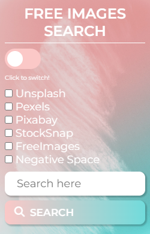

# README.md

## 📌 Introduction

This is an extension for web browsers that allows for searching for free images in one place. Simply click on the desired option and type in a search term. 

The user can click or simply hit `ENTER` to perform the search and the corresponding images will be presented. 

It is important to note that all sites are in your English version, so it is recommended to make searches in English as well. 

The tools used were:
Javascript for all the code's functionality, CSS for styling, and HTML for the structure and organization of the extension's elements.

In addition to them, it has a .json file for the necessary specifications for the extension to work perfectly.

## 👨‍💻 About the interface

This code is a browser extension designed for finding free images. It features an HTML form including checkboxes for selecting different image search websites such as Unsplash, Pexels, Pixabay, and more, as well as a search bar.

The added JavaScript manages the selection of options and the search, opening the corresponding pages of the selected websites with the corresponding search. It also includes verification to ensure that the user has selected an option and entered a search term before performing the search.

## 💻 Midia

### Interface

### Its functioning:

Interface on Google Chrome.

Interface on Microsoft Edge.

`!important` The interface was also tested (successfully) on the Opera GX browser. ✔️

## ⚙ How to add?

Go to chrome://extensions/. At the top right, turn on Developer mode. Click Load unpacked. Find and select the app or extension folder.

In other browsers the procedure is similar.

### ❤️ I hope you like it!

This was my final project for the CS50 course offered by Harvard, it was really challenging and quite rewarding for me to create it!

By the way, here is my LinkedIn profile! https://www.linkedin.com/in/rubens-fs/ (If you would like to connect with me, feel free! 😃).